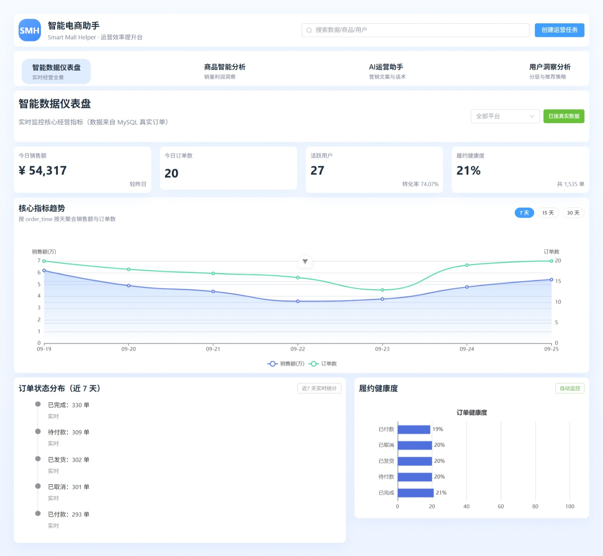
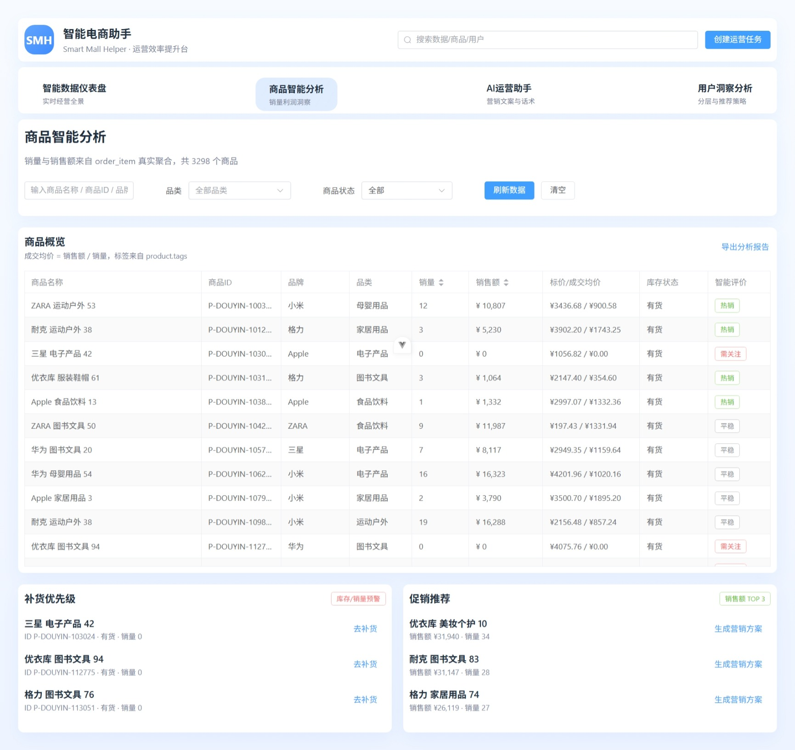
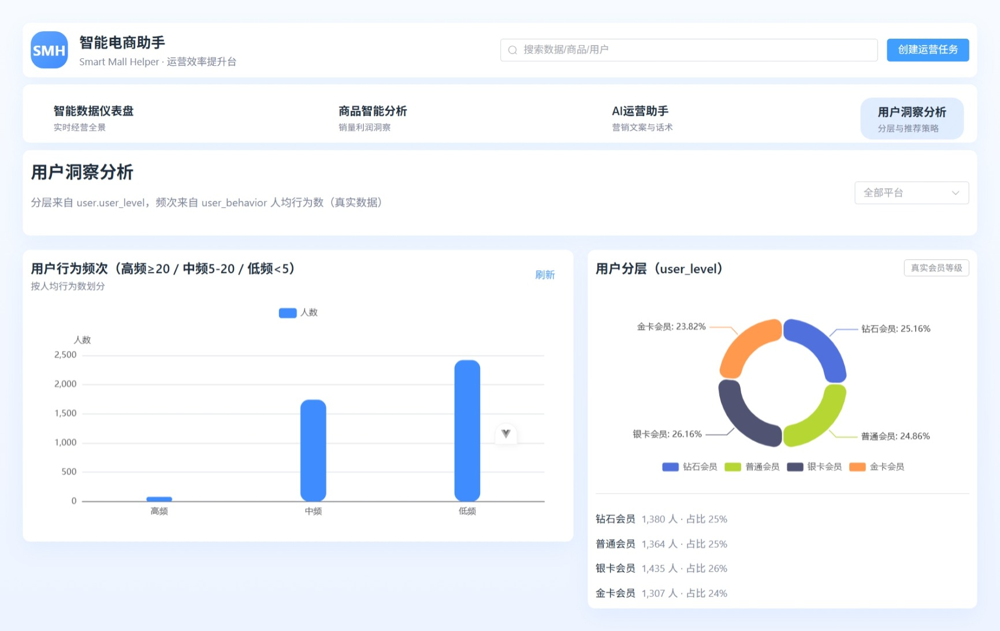
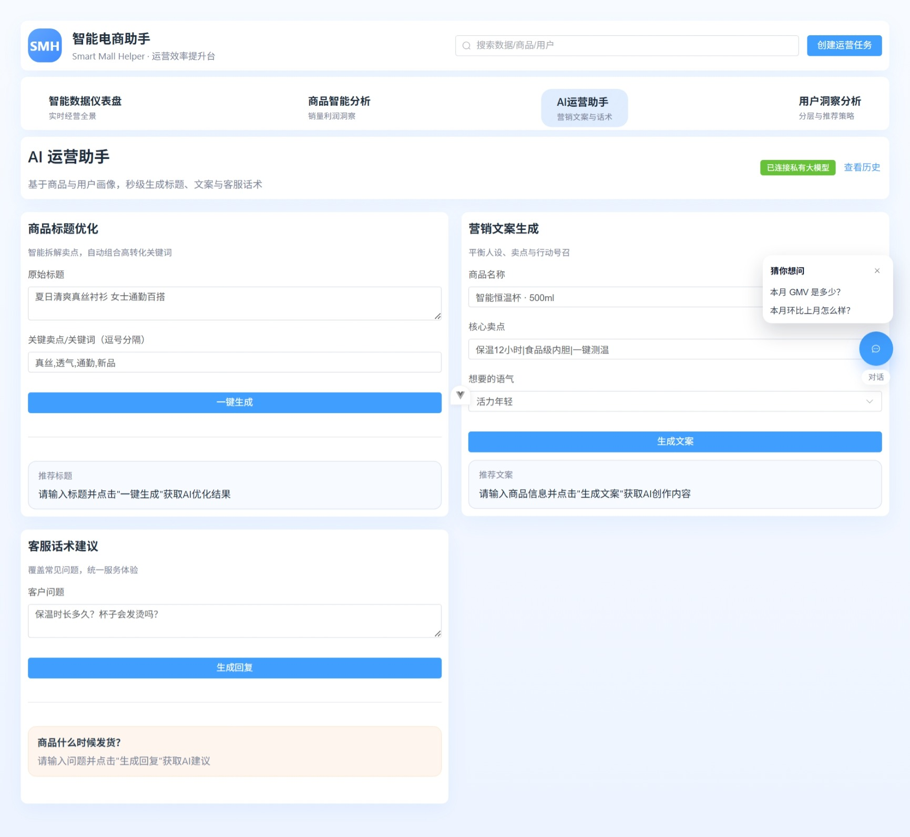
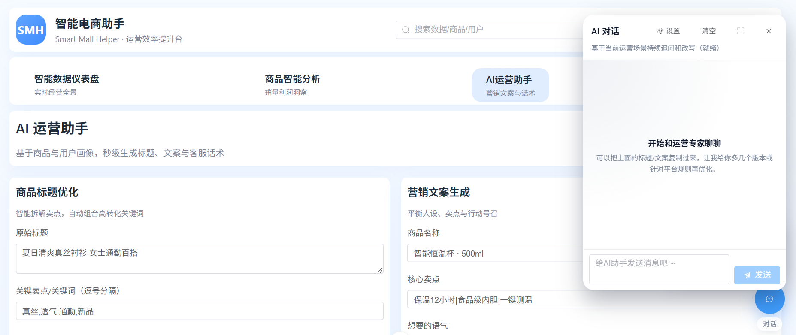
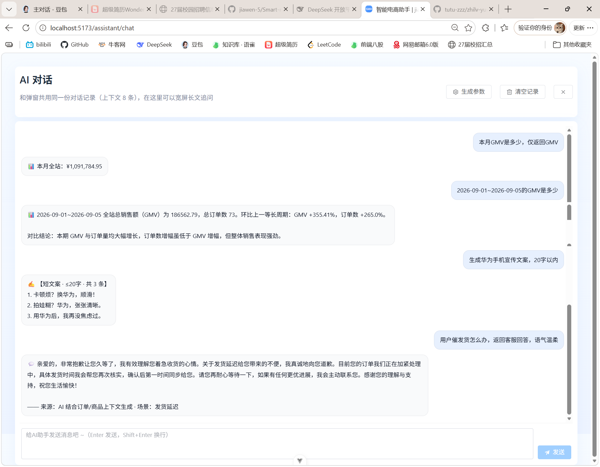
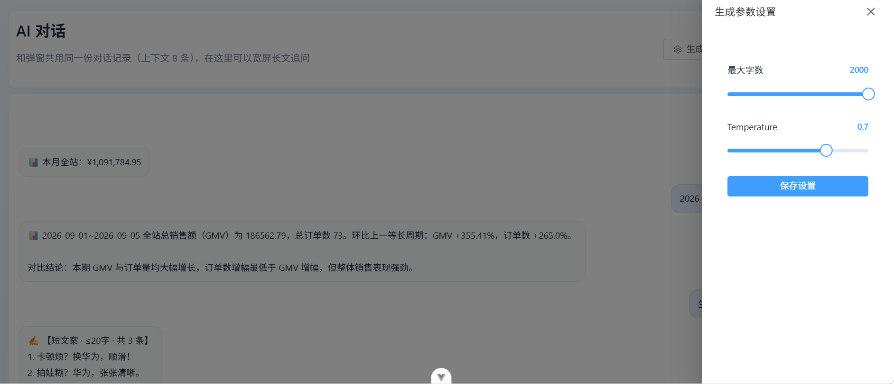
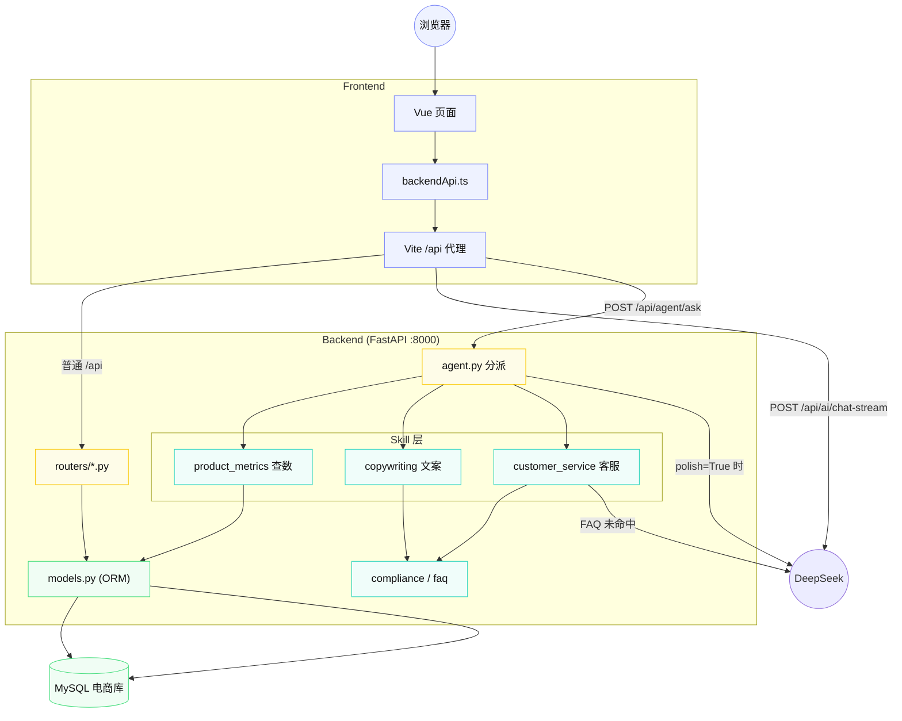
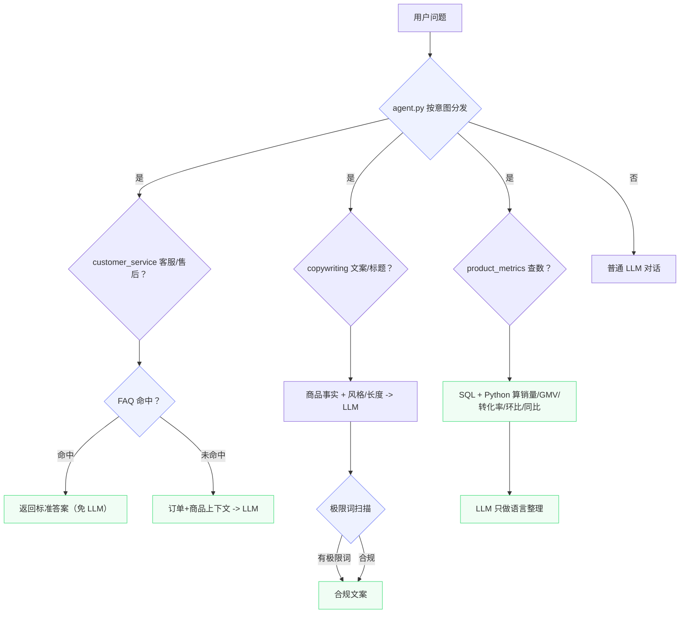

# 🛍️ 智能电商助手

> 融合大模型、SQL 真实查询与多 Skill 能力的高效电商运营分析系统

智能电商助手是一个面向电商运营场景的全栈项目。它直接对接你在本地 MySQL 中的真实电商业务数据（用户、商品、行为、订单及订单明细），把「数据查询」「文案创作」「客服回复」三大能力组织成可交互、可展示、可复用的产品原型。

和只输出一段文本的 LLM Demo 不同，这个项目更强调**链路落地与防幻觉**：

- **查数不靠大模型算** —— 销量、GMV、转化率、环比、同比等数值全部由 SQL + Python 精确计算，大模型只负责把结果翻译成自然语言；
- **文案自动合规** —— 文案草稿由大模型生成，但「广告法极限词」扫描与整改交给代码规则引擎，不依赖大模型自我审查；
- **客服先查 FAQ** —— 常见问题优先命中本地 FAQ 知识库直接返回标准答案（省一次 LLM 调用），未命中才结合订单与商品上下文走大模型，输出前统一敏感词过滤。

---

## 📝 最近更新

<details>
<summary><strong>查看版本更新记录（最新：2026-06-16）</strong></summary>

- `2026-06-16`
  - **三 Skill 贯通**：文案创意生成（Skill 2）与客服回复（Skill 3）接入 Agent 分派层。`agent.py` 支持同步/异步 Skill 混合调度、按签名透传参数、并新增 `/api/agent/ask/stream` 流式输出。
  - **文案合规**：广告法极限词扫描与整改（`compliance.py`）覆盖「绝对化、排名、唯一性、首创、保证、铁价、贬低竞品」等类别；客服输出统一过敏感词过滤。
  - **客服 FAQ**：本地 FAQ 知识库命中阈值下调，2 字关键词（如「尺码」「发票」）也能直接作答，未命中再走 LLM。
  - **深度思考回滚**：移除 `deepseek-reasoner` 推理模型接入，恢复普通 `deepseek-chat` 流式对话，不再消费思考 token。
- `2026-04-20`
  - 拆分 `backend/`、`frontend/` 双目录，新增 FastAPI + SQLAlchemy 后端，直接映射 MySQL 真实电商表（platform / user / product / user_behavior / order / order_item 及字典表）。
  - 仪表盘、商品分析、用户洞察三个页面由假数据替换为后端真实数据，Vite 代理统一转发 `/api` 到 `:8000`。

</details>

---

## 📸 效果展示

### 首页仪表盘



### 商品智能分析



### 用户洞察分析



### AI 运营助手



### AI 对话弹窗



### AI 对话全屏页



### 生成参数设置



---

## ✨ 项目亮点

- 🧠 **三 Skill Agent**：语音化意图识别分发到「查数 / 文案 / 客服」三个独立 Skill，每个 Skill 一个文件、职责清晰
- 🛡️ **防幻觉数值计算**：销量、GMV、转化率、环比/同比全部由后端 SQL + Python 计算，LLM 只做语言整理，杜绝编造数字
- 💻 **接入真实数据**：直接连接本地 MySQL 电商业务库，仪表盘 KPI、趋势、订单健康度、商品销量、用户分层均来自真实订单数据
- ✍️ **文案创意生成**：基于商品事实生成标题、卖点、短视频口播文案，支持简约 / 种草 / 直播风三档风格与多版本切换
- ⚖️ **广告合规规则引擎**：自动扫描「最、第一、全网第一、国家级、100%」等极限词并给出整改版，不依赖大模型自律
- 💬 **客服 FAQ 优先**：常用售后问题命中本地 FAQ 直接返回标准答案，省 LLM 调用；未命中再结合订单 + 商品上下文生成
- 🛡️ **敏感词过滤**：客服话术输出前统一过敏感词规则库
- 🎛️ **可控生成参数**：最大字数、Temperature 可调，文案支持「只给标题 / 只给卖点 / 只给口播」精细控制
- 📦 **多端对话**：AI 对话弹窗与全屏页共用一份历史记录，支持继续追问

---

## 🏗️ 技术架构

### 技术栈

- 后端：FastAPI + Pydantic + SQLAlchemy
- 数据库：MySQL（真实电商业务数据）
- LLM：DeepSeek（OpenAI 兼容接口）
- 前端：Vue 3 + Vite + Element Plus + ECharts + Pinia
- 本地存储：IndexedDB（Dexie，会话与历史）

### 核心架构分层

| 层级 | 关键文件 | 职责 |
| :--- | :--- | :--- |
| 前端 | `frontend/src/views/*.vue` | 仪表盘、商品、用户、运营助手、AI 对话展示与交互 |
| UI 框架 | `frontend/src/App.vue` | 顶栏导航、全屏对话页隐藏导航 |
| 调用层 | `frontend/src/utils/backendApi.ts` | 后端接口统一封装 + Skill 意图判断 |
| Agent 接口层 | `backend/app/routers/agent.py` | 意图识别路由、Skill 分派、LLM 整理与流式输出 |
| 业务路由层 | `backend/app/routers/` | dashboard / products / users / orders / meta |
| Skill 层 | `backend/app/skills/` | 三个 Skill + 共用规则引擎 + LLM 封装 |
| ORM 模型 | `backend/app/models.py` | 映射 MySQL 真实电商表 |
| 配置 | `backend/app/config.py` | 环境变量、数据库连接、DeepSeek 配置 |

### 系统数据流



数据流路径：前端页面请求业务数据走 `/api/*` 或 `/api/dashboard/*` 直查 MySQL；用户发 AI 对话时先经 `agent.py` 做意图识别，匹配 Skill 1/2/3 则走对应 Skill（查数由代码算、文案/客服带规则校验），只有 Skill 1 的语言整理与普通对话才调用 DeepSeek。

### Skill 分派流程



## 防幻觉设计

这是本项目最核心的设计取舍：**数值与合规由代码保证，大模型只负责语言表达**。

- **查数 Skill（防数字幻觉）**：目标商品由 ID 精确匹配或名称/品牌/品类模糊匹配到 `product` 表；销量、GMV、订单数来自 `order_item ⨝ order` 聚合，转化率 = 订单数 / 浏览 PV，环比 = 与上一等长周期对比，同比 = 与去年同期对比——全部 Python 计算，禁止 LLM 改动数字。
- **文案 Skill（防合规疏漏）**：商品属性从数据库取，不让 LLM 编；生成的标题/卖点/口播先过广告法极限词规则引擎，命中即附整改版，不依赖大模型自我审查。
- **客服 Skill（防话术失控）**：先从本地 FAQ 标准答案库作答；走 LLM 时注入订单真实状态与商品信息，并约束「只使用上下文中的真实数据」，输出前统一过滤敏感词与极限词。

---

## 📁 项目结构

```text
智能电商助手/
├── backend/                          # FastAPI + SQLAlchemy 后端
│   ├── app/
│   │   ├── main.py                   # FastAPI 入口、CORS、路由注册
│   │   ├── config.py                 # 环境变量、MySQL / DeepSeek 配置
│   │   ├── database.py               # SQLAlchemy engine / session
│   │   ├── models.py                 # 映射 MySQL 真实电商表
│   │   ├── routers/
│   │   │   ├── agent.py              # Agent：意图识别 + Skill 分派 + 流式输出
│   │   │   ├── dashboard.py          # KPI / 趋势 / 漏斗
│   │   │   ├── products.py           # 商品列表 / 销量聚合 / 详情
│   │   │   ├── users.py              # 用户分层 / 列表
│   │   │   ├── orders.py             # 订单列表 / 健康度 / 详情
│   │   │   └── meta.py               # 字典表 + health 自检
│   │   └── skills/
│   │       ├── __init__.py           # Skill 注册表（顺序即优先级）
│   │       ├── llm.py                # DeepSeek 统一调用封装
│   │       ├── compliance.py         # 广告极限词 / 敏感词规则引擎
│   │       ├── faq.py                # 客服 FAQ 知识库
│   │       ├── product_metrics.py    # Skill 1 查数
│   │       ├── copywriting.py        # Skill 2 文案创意
│   │       └── customer_service.py   # Skill 3 客服回复
│   ├── requirements.txt
│   └── .env.example                  # 后端环境变量模板
├── frontend/                         # Vue 3 + Vite 前端
│   ├── src/
│   │   ├── views/
│   │   │   ├── DataDashboard.vue     # 智能数据仪表盘
│   │   │   ├── ProductIntelligence.vue # 商品智能分析
│   │   │   ├── UserInsights.vue      # 用户洞察分析
│   │   │   ├── AiOperationAssistant.vue # AI 运营助手（标题/文案/客服工具）
│   │   │   ├── AiChat.vue            # AI 对话悬浮弹窗
│   │   │   └── AiChatPage.vue        # AI 对话全屏页
│   │   ├── components/ThinkingBox.vue # 深度思考折叠框（已回滚停用）
│   │   ├── utils/
│   │   │   ├── backendApi.ts         # 后端调用层 + Skill 意图判断
│   │   │   └── aiApi.ts              # DeepSeek 流式调用
│   │   ├── stores/                   # Pinia + IndexedDB 会话记忆
│   │   ├── router/index.ts           # 前端路由
│   │   └── App.vue
│   ├── package.json
│   ├── vite.config.ts                # /api 代理 + AI 代理
│   └── .env.example
├── test_pic/                         # README 展示截图
├── .gitignore
└── README.md
```

> `frontend/src/components/ThinkingBox.vue` 为深度思考功能遗留组件，当前已不在聊天渲染中使用，可删除。

### 关键文件职责

**后端**

- `backend/app/routers/agent.py`
  Agent 路由层：意图识别分发、Skill 同步/异步混合调度、按签名透传参数、查数类 LLM 整理、文案/客服类代码整理，以及 `/ask/stream` 流式输出。
- `backend/app/skills/product_metrics.py`
  Skill 1 查数：商品 ID / 名称 / 品牌解析、时间范围解析（今天 / 近 N 天 / 明确日期区间）、销量 / GMV / 转化率 / 环比 / 同比计算。
- `backend/app/skills/copywriting.py`
  Skill 2 文案：商品上下文提取、风格（简约/种草/直播风）与长度解析、LLM 草稿 + 极限词校验 + 多版本整理。
- `backend/app/skills/customer_service.py`
  Skill 3 客服：订单 / 商品上下文加载、FAQ 优先命中、LLM 生成话术、敏感词过滤。
- `backend/app/skills/compliance.py`
  广告法极限词扫描 / 整改 + 敏感词过滤规则引擎。
- `backend/app/skills/faq.py`
  客服 FAQ 知识库与打分检索。
- `backend/app/models.py`
  SQLAlchemy 映射 10 张真实电商表：platform、order_status、payment_method、shipping_method、user、product、user_behavior、order、order_item。

**前端**

- `frontend/src/utils/backendApi.ts`
  所有后端接口封装 + `looksLikeSkillQuery` 意图判断 + Skill 2/3 直接调用方法。
- `frontend/src/views/DataDashboard.vue`
  仪表盘：KPI、趋势图、订单状态分布与履约健康度，随 7/15/30 天切换联动。
- `frontend/src/views/AiOperationAssistant.vue`
  运营助手：标题优化 / 文案生成 / 客服话术三个工具 + 浮动对话与「猜你想问」。
- `frontend/src/views/AiChat.vue` / `AiChatPage.vue`
  AI 对话弹窗与全屏页，共用一份历史记录，支持 Skill 优先应答。

---

## 🚀 启动项目

项目采用前后端分离，需要本地已安装 Python 3.11+、Node.js，并在本机 MySQL 中导入电商业务数据。以下命令默认从项目根目录 `智能电商助手/` 执行。

### 1. 配置并启动后端

```powershell
cd backend
Copy-Item .env.example .env
# 编辑 backend/.env，填写本地 MySQL 账号密码库名，以及 DeepSeek API Key
pip install -r requirements.txt
uvicorn app.main:app --reload --port 8000
```

后端启动后可访问：

```text
API:      http://127.0.0.1:8000
API 文档: http://127.0.0.1:8000/docs
```

建议先联调接口确认能连上 MySQL 并读到数据：

```text
GET http://127.0.0.1:8000/api/meta/health
# 返回 user_count / product_count / order_count / behavior_count，均大于 0 即连接成功
```

> ⚠️ `order` 是 MySQL 保留字，若建表时未用反引号会报错，届时把 `models.py` 中 `Order.__tablename__` 改为实际表名即可。

### 2. 配置并启动前端

```powershell
cd frontend
npm install
npm run dev
```

前端地址：`http://localhost:5173`。

前端 `vite.config.ts` 已把 `/api`（除 `/api/ai` 外）代理到 `http://127.0.0.1:8000`，所以页面请求 `/api/dashboard/metrics` 等会自动打到 FastAPI；`/api/ai/*` 由代理中间件直连 DeepSeek，无需改业务代码。

### 3. 验证 AI 对话

- 打开运营助手页右下角的「猜你想问」或对话弹窗发送问题；
- 查数类问题（如「本月GMV」「近7天销量」）走 Skill 1，返回真实查询结果（前缀 📊）；
- 文案类问题（如「帮智能恒温杯写直播风口播文案」）走 Skill 2（前缀 ✍️）；
- 客服类问题（如「退款多久到账」）走 Skill 3，FAQ 命中则免 LLM（前缀 💬）。

---

## 🔐 环境变量

### 后端 `backend/.env.example`

```env
MYSQL_HOST=127.0.0.1
MYSQL_PORT=3306
MYSQL_USER=root
MYSQL_PASSWORD=123456
MYSQL_DB=ecommerce
DEEPSEEK_API_KEY=your_deepseek_key
DEEPSEEK_API_URL=https://api.deepseek.com/chat/completions
```

> 说明：`DEEPSEEK_API_KEY` 为空时，Skill 会自动降级——查数走模板话术、文案走规则兜底文案、客服走 FAQ/规则模板，项目仍能运行。前端还需在 `frontend/.env.local` 配置 `DEEPSEEK_API_KEY`（供 `/api/ai` 代理直连 DeepSeek）。

---

## 📡 核心接口

### 业务数据接口

| 方法 | 路径 | 说明 |
| :--- | :--- | :--- |
| `GET` | `/api/meta/health` | 四张主表数量自检（连库验证） |
| `GET` | `/api/meta/platforms` | 平台列表（下拉筛选用） |
| `GET` | `/api/dashboard/metrics?platform=` | 今日销售额 / 订单数 / 活跃用户 / 转化率 |
| `GET` | `/api/dashboard/trend?range=7d&platform=` | 趋势（7/15/30 天） |
| `GET` | `/api/dashboard/funnel?platform=` | 用户行为漏斗 |
| `GET` | `/api/products?keyword=&category=&platform=&page=` | 商品列表 + 销量聚合 |
| `GET` | `/api/products/categories` | 品类列表 |
| `GET` | `/api/orders?status=&platform=&page=` | 订单列表 |
| `GET` | `/api/orders/health?days=&platform=` | 订单状态分布 / 履约健康度 |
| `GET` | `/api/users/segments?platform=` | 用户分层 + 行为频次 |

### Agent / Skill 接口

| 方法 | 路径 | 说明 |
| :--- | :--- | :--- |
| `POST` | `/api/agent/ask` | 意图识别 + Skill 分派（返回 `{skill, answer, data}`） |
| `POST` | `/api/agent/ask/stream` | 同上，SSE 流式逐字输出 |
| `GET` | `/api/agent/skill/product-metrics` | Skill 1 直调（纯 JSON，不经过 LLM） |
| `POST` | `/api/agent/skill/copywriting` | Skill 2 直调（多套文案 + 极限词校验） |
| `POST` | `/api/agent/skill/customer-service` | Skill 3 直调（FAQ 优先） |
| `GET` | `/api/agent/faq` | FAQ 知识库列表 |

### Skill 请求示例

#### Skill 2 文案创意

```http
POST /api/agent/skill/copywriting
Content-Type: application/json

{
  "question": "帮智能恒温杯写直播风口播文案",
  "style": "直播风",
  "variants": 3,
  "length": 20,
  "regenerate": false
}
```

#### Skill 3 客服回复

```http
POST /api/agent/skill/customer-service
Content-Type: application/json

{
  "question": "订单 AB123456789012 还没发货怎么办",
  "order_id": "AB123456789012",
  "history": [{"role": "user", "content": "之前问过退款"}]
}
```

---

## 🔄 关键业务链路

### Skill 1：商品与核心指标查询

```text
用户问题（如"近7天销量"）
  -> agent.py 意图识别 -> 命中 product_metrics
  -> parse_time_range 解析时间（今天/近N天/日期区间）
  -> resolve_products 定位商品（ID 精确 -> 名称/品牌模糊）
  -> SQL 聚合（order_item ⨝ order，按 order_time 过滤）
  -> Python 计算销量 / GMV / 转化率 / 环比 / 同比
  -> LLM（可选）把 JSON 整理成自然语言
  -> 返回带真实数字的回答
```

### Skill 2：文案创意生成

```text
用户问题（如"写种草文案"）
  -> 命中 copywriting
  -> collect_context 从 product 表取商品事实（名称/品牌/品类/价格/标签）
  -> parse_style / parse_platform / parse_length 解析风格、平台、长度
  -> 填充预设 Prompt 模板 -> 调 DeepSeek 生成草稿
  -> compliance.scan_extreme 扫描广告法极限词
  -> 命中则附 sanitized 整改版；无 LLM 则用规则兜底文案
  -> 返回多套文案 {angle, title, selling_points, script, compliant}
```

### Skill 3：客服回复

```text
用户问题（如"退款多久到账"）
  -> 命中 customer_service
  -> 提取订单号 / 识别场景（发货延迟/退换货/物流…）
  -> load_order_context + find_product_context 取订单与商品上下文
  -> ① FAQ.search_faq 命中 -> 直接返回标准答案（免 LLM）
  -> ② 未命中 -> 携带订单/商品上下文调 LLM 生成话术
  -> compliance.mask_sensitive 敏感词过滤
  -> 输出回复话术（附来源与场景说明）
```

---

## 🛠️ 常见问题

### 页面没有数据

优先检查：

- 后端是否启动在 `8000`：`curl http://127.0.0.1:8000/api/meta/health`
- `backend/.env` 的 `MYSQL_HOST / USER / PASSWORD / DB` 是否与本地 MySQL 一致
- `order` 为 MySQL 保留字，建表未用反引号时会报错

### AI 对话报「API key not configured」

- `frontend/.env.local` 是否配置了 `DEEPSEEK_API_KEY`
- 修改 `.env` 后是否**重启前端** dev（vite 代理读环境变量，光热更新不重新加载）
- 若 skill 返回异常，浏览器 F12 看对 `/api/agent/ask` 的网络请求

### 文案 / 客服未走 Skill，直接进大模型

- 检查问题是否含 Skill 关键词（文案/标题/卖点/客服/退货/退款/发货/物流…）
- `frontend/src/utils/backendApi.ts` 的 `looksLikeSkillQuery` 命中后才会走后端；若命中仍直接对话，查看后端是否已重启加载最新 `agent.py`

### `npm run dev` 找不到 `package.json`

说明目录不对，前端命令必须在 `frontend/` 目录执行。

---

## ✅ 当前完成度

- ✅ **真实数据接入**：四张主表 health 自检、仪表盘 KPI / 趋势 / 订单健康度、商品销量聚合、用户分层均来自本地 MySQL
- ✅ **三 Skill Agent**：查数（Skill 1）、文案创意（Skill 2）、客服回复（Skill 3）独立文件、注册表统一调度、流式输出
- ✅ **防幻觉**：查数数值由代码计算；文案广告法极限词规则校验 + 整改；客服敏感词过滤
- ✅ **客服 FAQ 免 LLM**：常用售后问题命中知识库直接标准答案，降低调用成本
- ✅ **文案风格与参数**：简约 / 种草 / 直播风，标题长度、版本数、只给标题/卖点/口播精细控制
- ✅ **双向对话**：AI 对话弹窗与全屏页共用历史，运营助手「猜你想问」快捷发送
- ⚠️ **数据边界**：页面展示依赖本地 MySQL 已导入电商业务数据；演示数据为教学性质，不代表真实平台生产数据
- ⚠️ **外部模型依赖**：文案与客服的「创意质量」依赖 DeepSeek 账户与联网；无 key 时自动降级为规则兜底

---

## 🌱 后续优化方向

- 🚧 **Skill 4：库存 / 补货预警**：基于 `product.stock_status` 与销量趋势，主动提示补货优先级
- 🚧 **多轮记忆增强**：客服 Skill 的 `history` 目前可传，可在前端把会话上下文自动带到 Skill 3 实现真正多轮
- 🚧 **文案批量摊销**：调用文案 Skill 后保存营销方案到 IndexedDB，支持「重新生成」时做去重，避免重复角度
- 🚧 **登录与多用户**：当前为单用户本地 Demo，可增加用户隔离与权限
- 🚧 **告警 / 巡检**：仪表盘预警目前基于订单状态统计，可接入库存、退款异常等实时规则