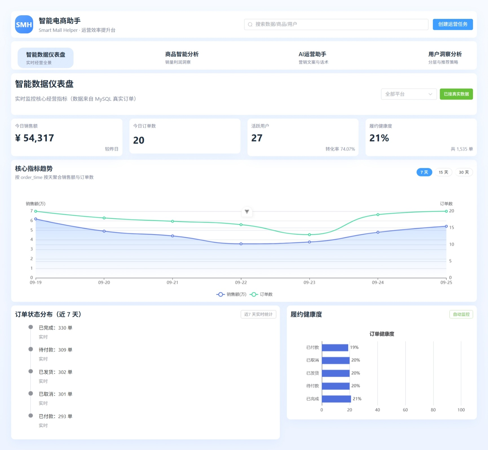
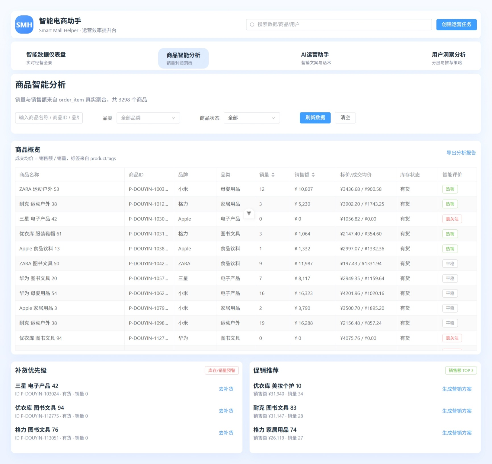
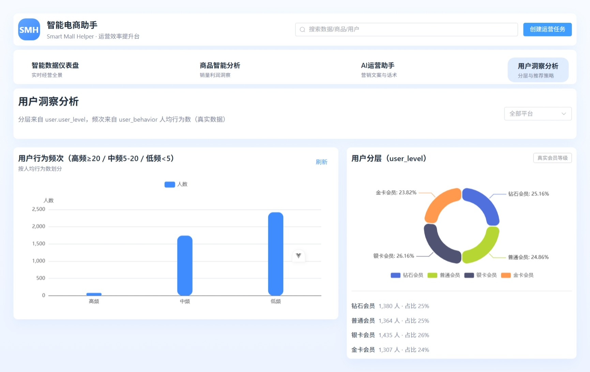
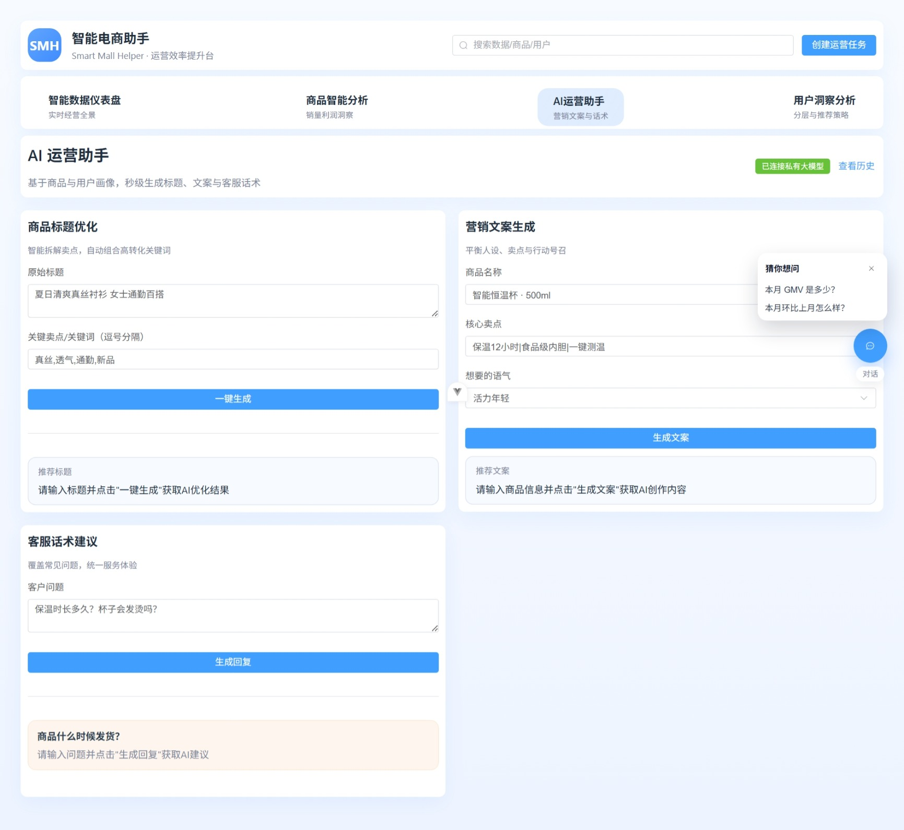
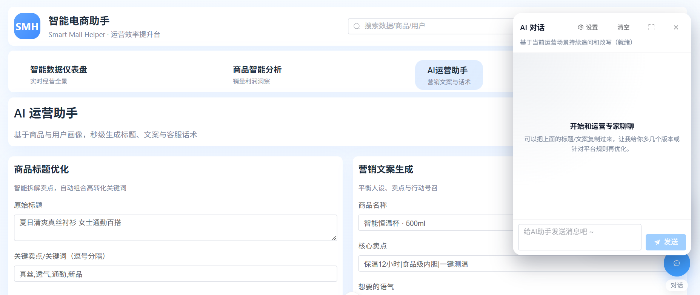
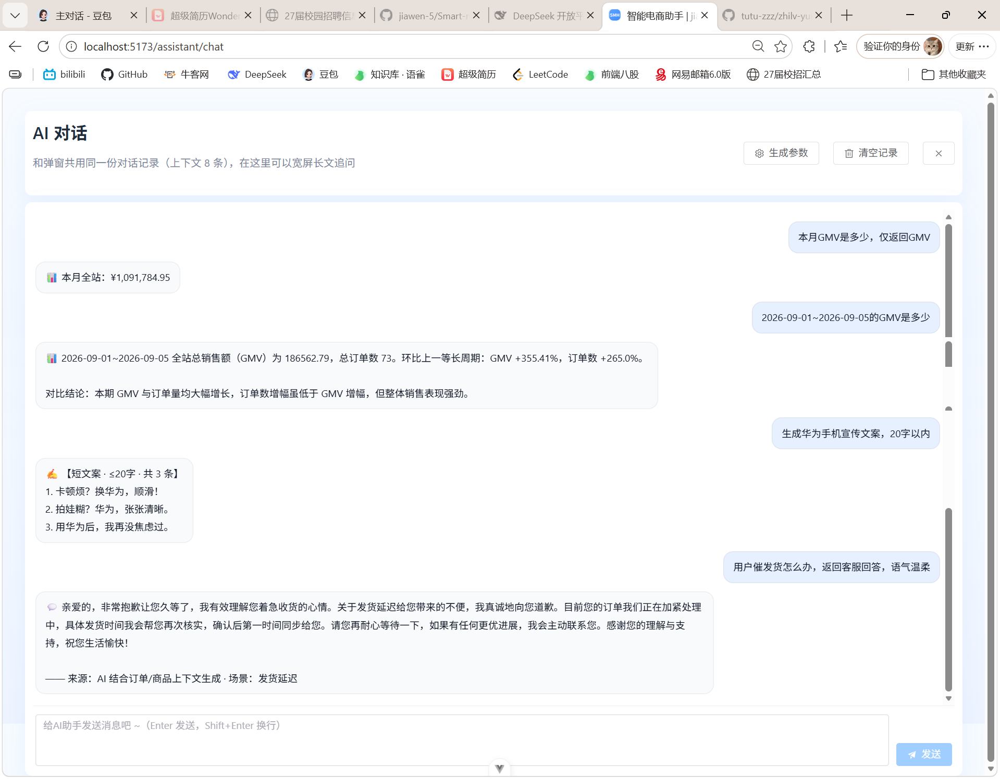
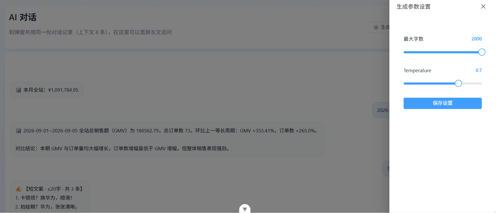
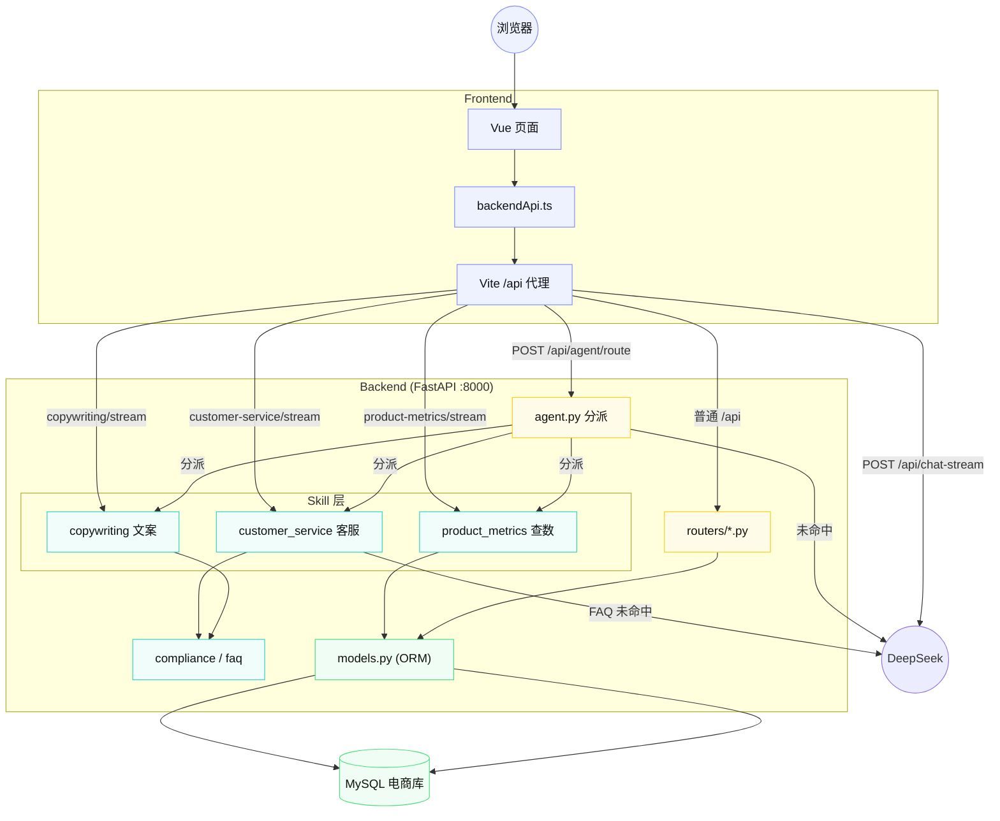
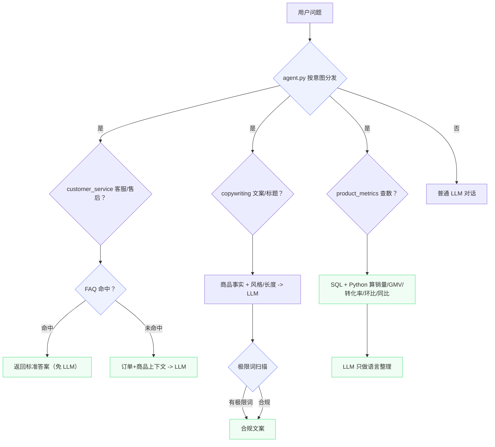

# 🛍️ 智能电商助手

> 融合大模型、SQL 真实查询与多 Skill 能力的高效电商运营分析系统

智能电商助手是一个面向电商运营场景的全栈项目。它直接对接你在本地 MySQL 中的真实电商业务数据（用户、商品、行为、订单及订单明细），把「数据查询」「文案创作」「客服回复」三大能力组织成可交互、可展示、可复用的产品原型。

和只输出一段文本的 LLM Demo 不同，这个项目更强调**链路落地与防幻觉**：

- **查数不靠大模型算** —— 销量、GMV、转化率、环比、同比等数值全部由 SQL + Python 精确计算，大模型只负责把结果翻译成自然语言；
- **文案自动合规** —— 文案草稿由大模型生成，但「广告法极限词」扫描与整改交给代码规则引擎，不依赖大模型自我审查；
- **客服先查 FAQ** —— 常见问题优先命中本地 FAQ 知识库直接返回标准答案（省一次 LLM 调用），未命中才结合订单与商品上下文走大模型，输出前统一敏感词过滤。

---

## 📸 效果展示

### 首页仪表盘



### 商品智能分析



### 用户洞察分析



### AI 运营助手



### AI 对话弹窗



### AI 对话全屏页



### 生成参数设置



---

## ✨ 项目亮点

- 🧠 **三 Skill Agent**：语音化意图识别分发到「查数 / 文案 / 客服」三个独立 Skill，每个 Skill 一个文件、职责清晰
- 🛡️ **防幻觉数值计算**：销量、GMV、转化率、环比/同比全部由后端 SQL + Python 计算，LLM 只做语言整理，杜绝编造数字
- 💻 **接入真实数据**：直接连接本地 MySQL 电商业务库，仪表盘 KPI、趋势、订单健康度、商品销量、用户分层均来自真实订单数据
- ✍️ **文案创意生成**：基于商品事实生成标题、卖点、短视频口播文案，支持简约 / 种草 / 直播风三档风格与多版本切换
- ⚖️ **广告合规规则引擎**：自动扫描「最、第一、全网第一、国家级、100%」等极限词并给出整改版，不依赖大模型自律
- 💬 **客服 FAQ 优先**：常用售后问题命中本地 FAQ 直接返回标准答案，省 LLM 调用；未命中再结合订单 + 商品上下文生成
- 🛡️ **敏感词过滤**：客服话术输出前统一过敏感词规则库
- 🎛️ **可控生成参数**：最大字数、Temperature 可调，文案支持「只给标题 / 只给卖点 / 只给口播」精细控制
- 📦 **多端对话**：AI 对话弹窗与全屏页共用一份历史记录，支持继续追问
- ⚡ **流式渲染不掉帧**：消息状态机（思考中 / 调用工具 / 生成中）+ chunk 缓冲队列按帧批量提交，流式回复不再逐字触发重渲染
- 🧵 **游标分页长列表**：历史消息按时间倒序每页 20 条从 IndexedDB 游标续读、顶部上滑加载更早消息并补偿滚动高度避免跳动
- 🧮 **Token 预算上下文**：对话上下文按 2000 token 预算动态取舍（中文 1 字≈2 token），而非固定消息条数，前端先裁、后端二次裁剪兜底
- 🧷 **Markdown 流式友好**：未闭合代码块 / 加粗 / 表格自动补全，贴底才自动跟随、否则手动回到底部，消除布局抖动
- 🔒 **输出净化**：AI 返回的富文本经 DOMPurify 白名单净化后渲染，防御 XSS 注入
- 🗂️ **接口网络可区分**：AI 对话按用途拆「普通返回 / 大模型流式 / 三 Skill 流式」独立接口，网络面板一眼看出当前调用链路

---

## 🏗️ 技术架构

### 技术栈

- 后端：FastAPI + Pydantic + SQLAlchemy
- 数据库：MySQL（真实电商业务数据）
- LLM：DeepSeek（OpenAI 兼容接口）
- 前端：Vue 3 + Vite + Element Plus + ECharts + Pinia
- 本地存储：IndexedDB（Dexie，会话与历史，游标分页读取）
- 富文本渲染：markdown-it + DOMPurify（流式补全 + XSS 净化）

### 核心架构分层

| 层级 | 关键文件 | 职责 |
| :--- | :--- | :--- |
| 前端 | `frontend/src/views/*.vue` | 仪表盘、商品、用户、运营助手、AI 对话展示与交互 |
| UI 框架 | `frontend/src/App.vue` | 顶栏导航、全屏对话页隐藏导航 |
| 循环渲染 | `frontend/src/components/VirtualChatList.vue` | 消息列表直渲（`v-for`）、滚动锚定、顶部触发游标加载 |
| 流式渲染 | `frontend/src/utils/streamBuffer.ts` | chunk 缓冲队列 + rAF/超时兜底批量提交 |
| 上下文裁剪 | `frontend/src/utils/contextBudget.ts` + `backend/app/context.py` | token 估算与预算内消息筛选（前端先裁、后端兜底，同口径同文件源） |
| 状态机 | `frontend/src/utils/chatStatus.ts` | 消息状态定义与合法转移 |
| 安全渲染 | `frontend/src/utils/markdownSafe.ts` | 流式 Markdown 补全 + 白名单净化 |
| 调用层 | `frontend/src/utils/aiApi.ts` + `backendApi.ts` | `callAI`（普通返回）/ `chatAIStream`（大模型流式）/ Skill 流式与意图路由 |
| 意图路由层 | `backend/app/routers/agent.py` | 意图识别、历史改写、上下文裁剪、Skill 分派、LLM 整理与流式输出 |
| 对话路由层 | `backend/app/routers/chat.py` | `/api/chat` 普通返回（无上下文）与 `/api/chat-stream` 大模型流式（2000 token 上下文） |
| 业务路由层 | `backend/app/routers/` | dashboard / products / users / orders / meta |
| Skill 层 | `backend/app/skills/` | 三个 Skill + 共用规则引擎 + LLM 封装 |
| ORM 模型 | `backend/app/models.py` | 映射 MySQL 真实电商表 |
| 配置 | `backend/app/config.py` | 环境变量、数据库连接、DeepSeek 配置 |

### 系统数据流


```mermaid
flowchart TD
    Client(("浏览器"))

    subgraph Frontend["Frontend"]
        Vue["Vue 页面"]
        BackendApi["backendApi.ts"]
        Vite["Vite /api 代理"]
    end

    subgraph Backend["Backend (FastAPI :8000)"]
        Routers["routers/*.py"]
        Agent["agent.py 分派"]
        subgraph Skills["Skill 层"]
            S1["product_metrics 查数"]
            S2["copywriting 文案"]
            S3["customer_service 客服"]
        end
        Rules["compliance / faq"]
        Models["models.py (ORM)"]
    end

    MySQL[("MySQL 电商库")]

    Client --> Vue --> BackendApi --> Vite

    %% 非 AI 业务接口
    Vite -->|普通 /api| Routers
    Routers --> Models --> MySQL

    %% AI 对话：先走 Skill（查数等），否则普通 LLM
    Vite -->|POST /api/chat-stream| DS((DeepSeek))

    Vite -->|POST /api/agent/route| Agent
    Agent -->|分派| S1
    Agent -->|分派| S2
    Agent -->|分派| S3
    Agent -->|未命中| DS

    %% Skill 流式：前端按 route 命中分支直连
    Vite -->|product-metrics/stream| S1
    Vite -->|copywriting/stream| S2
    Vite -->|customer-service/stream| S3
    S1 --> Models --> MySQL
    S2 --> Rules
    S3 --> Rules
    S3 -->|FAQ 未命中| DS

    classDef frontend fill:#eef2ff,stroke:#818cf8,color:#111;
    classDef backend fill:#fefce8,stroke:#facc15,color:#111;
    classDef skill fill:#f0fdfa,stroke:#2dd4bf,color:#111;
    classDef data fill:#f0fdf4,stroke:#4ade80,color:#111;

    class Client,Vue,BackendApi,Vite frontend;
    class Routers,Agent backend;
    class S1,S2,S3,Rules skill;
    class Models,MySQL data;
```

数据流路径：前端页面请求业务数据走 `/api/*` 或 `/api/dashboard/*` 直查 MySQL；用户发 AI 对话时先调轻量意图路由 `/api/agent/route`，匹配 Skill 1/2/3 则走对应 Skill 流式接口（查数由代码算、文案/客服带规则校验，网络面板分别显示 `product-metrics/stream`、`copywriting/stream`、`customer-service/stream`），未命中则走 `/api/chat-stream` 大模型流式；页面模块（标题优化 / 文案 / 话术工具）用 `/api/chat` 普通返回，不拼上下文。

### Skill 分派流程


```mermaid
flowchart TD
    Q["用户问题"]
    Router{"agent.py 按意图分发"}
    Cust{"customer_service 客服/售后？"}
    Copy{"copywriting 文案/标题？"}
    Metric{"product_metrics 查数？"}
    Fallback["普通 LLM 对话"]

    FAQ{"FAQ 命中？"}
    QA_Faq["返回标准答案（免 LLM）"]
    QA_Llm["订单+商品上下文 -> LLM"]

    Gen["商品事实 + 风格/长度 -> LLM"]
    Check{"极限词扫描"}
    OK["合规文案"]

    Calc["SQL + Python 算销量/GMV/转化率/环比/同比"]
    Polish["LLM 只做语言整理"]

    Q --> Router
    Router -->|是| Cust
    Router -->|是| Copy
    Router -->|是| Metric
    Router -->|否| Fallback

    Cust --> FAQ
    FAQ -->|命中| QA_Faq
    FAQ -->|未命中| QA_Llm

    Copy --> Gen --> Check -->|有极限词| OK
    Check -->|合规| OK

    Metric --> Calc --> Polish

    classDef out fill:#f0fdf4,stroke:#4ade80;
    classDef logic fill:#eef2ff,stroke:#818cf8;
    class FAQ,Check,Router logic;
    class QA_Faq,QA_Llm,OK,Polish,Calc out;
```

## ⚡ AI 对话渲染与上下文优化

AI 对话是高频交互场景，本项目针对「流式输出卡顿、长会话卡死、上下文失控、XSS 风险」四类问题做了成体系的优化。

### 1. 消息有限状态机

消息生命周期统一由状态机驱动，非法转移自动忽略，避免「菊花转到底」的假等待：

```text
idle → thinking → tool_calling → answering → idle
                     ↘ error ↗
```

- 普通对话：`thinking → answering`（两态退化，走 `/api/chat-stream`）；
- 命中 Skill：`thinking → tool_calling → answering`，「调用工具」阶段显式提示「正在查询业务数据…」，把 Skill 查询空窗期可视化；按命中 Skill 分别走 `/api/agent/skill/product-metrics/stream`、`copywriting/stream`、`customer-service/stream` 三个流式接口，先经 `/api/agent/route` 轻量意图路由（只跑 matcher，不执行 Skill / LLM）判断走哪个分支；
- 页面模块（标题优化 / 文案 / 客服工具）用 `/api/chat` 普通返回，单次请求、不做上下文；
- 异常走 `error`，`finally` 强制回 `idle`，杜绝状态卡死。

### 2. chunk 缓冲队列 + requestAnimationFrame 批量提交

SSE 高频 `onDelta` 只做入队，`rAF` 每帧最多提交一次 state：

```text
onDelta → queue → requestAnimationFrame → flush → 单次 state 更新
```

- 流式期间只改内存（`patchChatMessageContent`），**不写 IndexedDB**，流结束才落盘一次；
- 后台标签页 `rAF` 被挂起时自动降级为 `setTimeout(50ms)` 兜底；
- 效果：Pinia 更新频率从「每秒数十次」降到「≤60fps」。

### 3. 游标分页 + 滚动锚定

- **分页**：`chatMessages` 按 `createdAt` 倒序建索引，首屏只查最新 20 条；滚动到顶部时以 `cursor = 已加载最早一条 createdAt` 继续向前读下一页（多取 1 条做同毫秒去重），内存上限 200 条。
- **渲染**：会话规模在单页内可承受，`VirtualChatList` 用普通 `v-for` 直渲（避免虚拟化库与打包版本不一致导致的运行时崩溃），配合 `measureElement` 思路——每条消息固定行内自适应高度。
- **加载体验**：顶部加载后按 `scrollHeight` 差值补偿 `scrollTop`，避免向前翻页时视口跳动；打开对话自动钉底到最新消息；回看历史时自动贴合改为手动「回到底部」按钮。

### 4. Markdown 流式渲染优化

- **自动补全**：流式中未闭合的 ```` ``` ````、`**`、行内代码、表格尾管自动补齐，避免半截语法导致整段内容消失 / 闪烁。
- **滚动锚定**：仅当用户贴底（80px 内）时自动跟随最新内容，回看历史时不被强行拽回，改为展示「回到底部」按钮。

### 5. 输出净化防 XSS

AI 输出视为不可信输入，统一走 `markdown-it（html: false）→ DOMPurify 白名单净化` 后才 `v-html` 渲染，剥离 `script / img / on*` 事件等危险节点，`table / code / pre / a` 等正常排版标签保留。

### 6. Token 预算上下文

不再固定截取最近 N 条消息，改为 **token 预算制**（简易估算：中文 1 字 ≈ 2 token，英文 1 词 ≈ 1 token，单条含 4 token 开销）：

```text
从最新消息向前累加 → 超过 2000 token 预算即停 → 丢弃更早的消息
（单条自身超预算时，二分截断仅保留尾部可用部分）
```

- **统一口径**：前后端共用一套估算与裁剪逻辑。前端「先裁再发」——`chatAIStream`、`routeSkill`、三个 Skill 流式调用在发送前都用 `contextBudget.ts` 裁到 2000 token（单条上限 800 字），线上传的就是实际用的上下文；后端 `backend/app/context.py` 是裁剪规则的**唯一权威实现**，`agent.py`、`chat.py`、`customer_service.py`、`copywriting.py` 均匀导入复用，并在接收端按同口径二次裁剪兜底防伪造。
- **「再来一个 / 换一批」等追问**：文案 Skill 也接收裁剪后的历史（`CopywritingIn.history`），多轮指代改写后仍能延续上文意图。
- **普通调用不带上下文**：`/api/chat` 仅取当前 `prompt` 单条，不拼历史，适合标题优化 / 话术生成等一次性生成场景。
- **短消息多带、长回复少带**，比固定条数更贴合真实请求成本；对话页实时显示「上下文 N 条 · 约 X token / 2000」，便于观测。

---

## 防幻觉设计

这是本项目最核心的设计取舍：**数值与合规由代码保证，大模型只负责语言表达**。

- **查数 Skill（防数字幻觉）**：目标商品由 ID 精确匹配 → 品类匹配（「母婴类产品」按 `category/subcategory` 聚合）→ 名称/品牌/品类模糊匹配逐级兜底；销量、GMV、订单数来自 `order_item ⨝ order` 聚合，转化率 = 订单数 / 浏览 PV，环比 = 与上一等长周期对比，同比 = 与去年同期对比——全部 Python 计算，禁止 LLM 改动数字；未匹配到具体商品时才回落平台 / 全站汇总。
- **文案 Skill（防合规疏漏）**：商品属性从数据库取，不让 LLM 编；生成的标题/卖点/口播先过广告法极限词规则引擎，命中即附整改版，不依赖大模型自我审查。
- **客服 Skill（防话术失控）**：先从本地 FAQ 标准答案库作答；走 LLM 时注入订单真实状态与商品信息，并约束「只使用上下文中的真实数据」，输出前统一过滤敏感词与极限词。

---

## 📁 项目结构

```text
智能电商助手/
├── backend/                          # FastAPI + SQLAlchemy 后端
│   ├── app/
│   │   ├── main.py                   # FastAPI 入口、CORS、路由注册
│   │   ├── config.py                 # 环境变量、MySQL / DeepSeek 配置
│   │   ├── database.py               # SQLAlchemy engine / session
│   │   ├── models.py                 # 映射 MySQL 真实电商表
│   │   ├── context.py                 # 上下文 token 预算裁剪（前后端唯一权威实现）
│   │   ├── routers/
│   │   │   ├── agent.py              # Agent：意图路由 / Skill 分派与流式输出
│   │   │   ├── chat.py               # /api/chat（普通返回）+ /api/chat-stream（大模型流式）
│   │   │   ├── dashboard.py          # KPI / 趋势 / 漏斗
│   │   │   ├── products.py           # 商品列表 / 销量聚合 / 详情
│   │   │   ├── users.py              # 用户分层 / 列表
│   │   │   ├── orders.py             # 订单列表 / 健康度 / 详情
│   │   │   └── meta.py               # 字典表 + health 自检
│   │   └── skills/
│   │       ├── __init__.py           # Skill 注册表（顺序即优先级）
│   │       ├── llm.py                # DeepSeek 统一调用封装
│   │       ├── compliance.py         # 广告极限词 / 敏感词规则引擎
│   │       ├── faq.py                # 客服 FAQ 知识库
│   │       ├── product_metrics.py    # Skill 1 查数
│   │       ├── copywriting.py        # Skill 2 文案创意
│   │       └── customer_service.py   # Skill 3 客服回复
│   ├── requirements.txt
│   └── .env.example                  # 后端环境变量模板
├── frontend/                         # Vue 3 + Vite 前端
│   ├── src/
│   │   ├── views/
│   │   │   ├── DataDashboard.vue     # 智能数据仪表盘
│   │   │   ├── ProductIntelligence.vue # 商品智能分析
│   │   │   ├── UserInsights.vue      # 用户洞察分析
│   │   │   ├── AiOperationAssistant.vue # AI 运营助手（标题/文案/客服工具）
│   │   │   ├── AiChat.vue            # AI 对话悬浮弹窗
│   │   │   └── AiChatPage.vue        # AI 对话全屏页
│   │   ├── components/ThinkingBox.vue # 深度思考折叠框（已回滚停用）
│   │   ├── components/VirtualChatList.vue # 消息列表（游标加载 + 滚动锚定）
│   │   ├── components/MarkdownRender.vue  # 流式 Markdown 渲染（补全 + 净化）
│   │   ├── utils/
│   │   │   ├── aiApi.ts              # callAI（普通返回）/ chatAIStream（大模型流式）
│   │   │   ├── backendApi.ts         # 后端调用层 + 意图路由 + 三 Skill 流式
│   │   │   ├── contextBudget.ts      # token 估算与预算裁剪（前后端同口径）
│   │   │   ├── streamBuffer.ts       # chunk 缓冲队列 + rAF 批量提交
│   │   │   ├── chatStatus.ts         # 消息状态机定义与转移规则
│   │   │   └── markdownSafe.ts       # 流式补全 + 净化白名单 + 滚动判定
│   │   ├── stores/                   # Pinia + IndexedDB 会话记忆（游标分页）
│   │   ├── router/index.ts           # 前端路由
│   │   └── App.vue
│   ├── package.json
│   ├── vite.config.ts                # /api 代理 + AI 代理
│   └── .env.example
├── test_pic/                         # README 展示截图
├── .gitignore
└── README.md
```

> `frontend/src/components/ThinkingBox.vue` 为深度思考功能遗留组件，当前已不在聊天渲染中使用，可删除。

### 关键文件职责

**后端**

- `backend/app/routers/agent.py`
  Agent 路由层：`/api/agent/route` 轻量意图路由（只跑 matcher，不执行 Skill / LLM）、历史指代改写、token 预算上下文裁剪、意图识别分发、Skill 同步/异步混合调度、按签名透传参数、查数类 LLM 整理、文案/客服类代码整理，以及三个 Skill 的流式输出（`product-metrics/stream`、`copywriting/stream`、`customer-service/stream`），SSE 顺序 `thinking → tool_calling → answering → done`。
- `backend/app/routers/chat.py`
  对话路由层：`/api/chat` 普通调用（只取当前 prompt，不做上下文，供页面模块用）与 `/api/chat-stream` 大模型流式（2000 token 上下文裁剪，SSE 顺序 `thinking → answering`），统一走 FastAPI 网关，DeepSeek 请求只在此与 Skill 内部发出。
- `backend/app/context.py`
  上下文 token 预算裁剪的**唯一权威实现**（`trim_history`），被 `agent.py`、`chat.py`、`customer_service.py`、`copywriting.py` 复用；与前端 `contextBudget.ts` 同估算口径，前端先裁、后端兜底。
- `backend/app/skills/product_metrics.py`
  Skill 1 查数：商品 ID / 品类 / 名称 / 品牌逐级解析、时间范围解析（今天 / 近 N 天 / 明确日期区间）、销量 / GMV / 转化率 / 环比 / 同比计算，品类查询按 GMV 降序并给出销量最高款结论。
- `backend/app/skills/copywriting.py`
  Skill 2 文案：商品上下文提取、风格（简约/种草/直播风）与长度解析、LLM 草稿 + 极限词校验 + 多版本整理；接收 `history` 走 2000 token 裁剪，支持「再来一个 / 换一批」多轮追问。
- `backend/app/skills/customer_service.py`
  Skill 3 客服：订单 / 商品上下文加载、FAQ 优先命中、LLM 生成话术（历史按 2000 token 裁剪，不再固定后 6 条）、敏感词过滤。
- `backend/app/skills/compliance.py`
  广告法极限词扫描 / 整改 + 敏感词过滤规则引擎。
- `backend/app/skills/faq.py`
  客服 FAQ 知识库与打分检索。
- `backend/app/models.py`
  SQLAlchemy 映射 10 张真实电商表：platform、order_status、payment_method、shipping_method、user、product、user_behavior、order、order_item。

**前端**

- `frontend/src/utils/backendApi.ts`
  `routeSkill`（意图路由，先裁 2000 token 再发）、三个 Skill 流式调用（`streamProductMetrics / streamCopywriting / streamCustomerService`，均带裁剪后历史与订单号）+ Skill 2/3 直接调用方法。
- `frontend/src/utils/aiApi.ts`
  `callAI`（`/api/chat` 普通返回，无上下文）+ `chatAIStream`（`/api/chat-stream` 大模型流式，2000 token 上下文）。
- `frontend/src/utils/contextBudget.ts`
  token 估算与预算筛选：从最新消息向前累加，超预算即停，与后端 `context.py` 同口径（前后端一份逻辑）。
- `frontend/src/utils/streamBuffer.ts`
  chunk 缓冲队列：`rAF` 每帧批量提交，后台标签页降级 `setTimeout` 兜底。
- `frontend/src/components/VirtualChatList.vue`
  消息列表：普通 `v-for` 直渲、滚动锚定、打开自动钉底、顶部触发游标加载（已移除虚拟滚动库，避免版本不一致导致的运行时崩溃）。
- `frontend/src/views/DataDashboard.vue`
  仪表盘：KPI、趋势图、订单状态分布与履约健康度，随 7/15/30 天切换联动。
- `frontend/src/views/AiOperationAssistant.vue`
  运营助手：标题优化 / 文案生成 / 客服话术三个工具 + 浮动对话与「猜你想问」。
- `frontend/src/views/AiChat.vue` / `AiChatPage.vue`
  AI 对话弹窗与全屏页，共用一份历史记录与同一套流式渲染管线（状态机 + 缓冲 + 虚拟滚动 + 上下文预算）。

---

## 🚀 启动项目

项目采用前后端分离，需要本地已安装 Python 3.11+、Node.js，并在本机 MySQL 中导入电商业务数据。以下命令默认从项目根目录 `智能电商助手/` 执行。

### 1. 配置并启动后端

```powershell
cd backend
Copy-Item .env.example .env
# 编辑 backend/.env，填写本地 MySQL 账号密码库名，以及 DeepSeek API Key
pip install -r requirements.txt
uvicorn app.main:app --reload --port 8000
```

后端启动后可访问：

```text
API:      http://127.0.0.1:8000
API 文档: http://127.0.0.1:8000/docs
```

建议先联调接口确认能连上 MySQL 并读到数据：

```text
GET http://127.0.0.1:8000/api/meta/health
# 返回 user_count / product_count / order_count / behavior_count，均大于 0 即连接成功
```

> ⚠️ `order` 是 MySQL 保留字，若建表时未用反引号会报错，届时把 `models.py` 中 `Order.__tablename__` 改为实际表名即可。

### 2. 配置并启动前端

```powershell
cd frontend
npm install
npm run dev
```

前端地址：`http://localhost:5173`。

前端 `vite.config.ts` 已把 `/api` 代理到 `http://127.0.0.1:8000`，页面请求 `/api/dashboard/metrics`、`/api/chat-stream`、`/api/agent/route` 等所有接口都会自动打到 FastAPI；**所有 AI 调用（普通返回、大模型流式、Skill 流式）都走后端 Python 网关**，不再由前端直连 DeepSeek。

### 3. 验证 AI 对话

- 打开运营助手页右下角的「猜你想问」或对话弹窗发送问题；
- 查数类问题（如「本月GMV」「近7天销量」）走 Skill 1，返回真实查询结果（前缀 📊）；
- 文案类问题（如「帮智能恒温杯写直播风口播文案」）走 Skill 2（前缀 ✍️）；
- 客服类问题（如「退款多久到账」）走 Skill 3，FAQ 命中则免 LLM（前缀 💬）。

---

## 🔐 环境变量

### 后端 `backend/.env.example`

```env
MYSQL_HOST=127.0.0.1
MYSQL_PORT=3306
MYSQL_USER=root
MYSQL_PASSWORD=123456
MYSQL_DB=ecommerce
DEEPSEEK_API_KEY=your_deepseek_key
DEEPSEEK_API_URL=https://api.deepseek.com/chat/completions
```

> 说明：`DEEPSEEK_API_KEY` 为空时，Skill 会自动降级——查数走模板话术、文案走规则兜底文案、客服走 FAQ/规则模板，项目仍能运行。API Key 只需在后端配置，前端所有 AI 请求都经 FastAPI 转发，无需在前端填写 Key。

---

## 📡 核心接口

### 业务数据接口

| 方法 | 路径 | 说明 |
| :--- | :--- | :--- |
| `GET` | `/api/meta/health` | 四张主表数量自检（连库验证） |
| `GET` | `/api/meta/platforms` | 平台列表（下拉筛选用） |
| `GET` | `/api/dashboard/metrics?platform=` | 今日销售额 / 订单数 / 活跃用户 / 转化率 |
| `GET` | `/api/dashboard/trend?range=7d&platform=` | 趋势（7/15/30 天） |
| `GET` | `/api/dashboard/funnel?platform=` | 用户行为漏斗 |
| `GET` | `/api/products?keyword=&category=&platform=&page=` | 商品列表 + 销量聚合 |
| `GET` | `/api/products/categories` | 品类列表 |
| `GET` | `/api/orders?status=&platform=&page=` | 订单列表 |
| `GET` | `/api/orders/health?days=&platform=` | 订单状态分布 / 履约健康度 |
| `GET` | `/api/users/segments?platform=` | 用户分层 + 行为频次 |

### 对话接口

| 方法 | 路径 | 说明 |
| :--- | :--- | :--- |
| `POST` | `/api/chat` | 普通调用，只取当前 prompt，不做上下文（标题/文案/话术模块用） |
| `POST` | `/api/chat-stream` | 大模型流式输出（闲聊兜底），SSE：`thinking → answering`，2000 token 上下文 |

### Agent / Skill 接口

| 方法 | 路径 | 说明 |
| :--- | :--- | :--- |
| `POST` | `/api/agent/route` | 轻量意图路由：只跑 matcher 返回 `{skill }`，不执行 Skill / LLM，前端据此选流式接口 |
| `POST` | `/api/agent/skill/product-metrics/stream` | Skill 1 查数流式，SSE：`thinking → tool_calling → answering → done`（网络显示 `product-metrics`） |
| `POST` | `/api/agent/skill/copywriting/stream` | Skill 2 文案流式，同上状态机（网络显示 `copywriting`） |
| `POST` | `/api/agent/skill/customer-service/stream` | Skill 3 客服流式，同上状态机（网络显示 `customer-service`） |
| `POST` | `/api/agent/ask` | 意图识别 + Skill 分派（返回 `{skill, answer, data}`，兼容旧调用） |
| `GET` | `/api/agent/skill/product-metrics` | Skill 1 直调（纯 JSON，不经过 LLM） |
| `POST` | `/api/agent/skill/copywriting` | Skill 2 直调（多套文案 + 极限词校验，支持 `history`） |
| `POST` | `/api/agent/skill/customer-service` | Skill 3 直调（FAQ 优先） |
| `GET` | `/api/agent/faq` | FAQ 知识库列表 |

### Skill 请求示例

#### Skill 2 文案创意

```http
POST /api/agent/skill/copywriting
Content-Type: application/json

{
  "question": "帮智能恒温杯写直播风口播文案",
  "style": "直播风",
  "variants": 3,
  "length": 20,
  "regenerate": false
}
```

#### Skill 3 客服回复

```http
POST /api/agent/skill/customer-service
Content-Type: application/json

{
  "question": "订单 AB123456789012 还没发货怎么办",
  "order_id": "AB123456789012",
  "history": [{"role": "user", "content": "之前问过退款"}]
}
```

---

## 🔄 关键业务链路

### Skill 1：商品与核心指标查询

```text
用户问题（如"近7天销量"）
  -> agent.py 意图识别 -> 命中 product_metrics
  -> parse_time_range 解析时间（今天/近N天/日期区间）
  -> resolve_products 定位商品（ID 精确 -> 名称/品牌模糊）
  -> SQL 聚合（order_item ⨝ order，按 order_time 过滤）
  -> Python 计算销量 / GMV / 转化率 / 环比 / 同比
  -> LLM（可选）把 JSON 整理成自然语言
  -> 返回带真实数字的回答
```

### Skill 2：文案创意生成

```text
用户问题（如"写种草文案"）
  -> 命中 copywriting
  -> collect_context 从 product 表取商品事实（名称/品牌/品类/价格/标签）
  -> parse_style / parse_platform / parse_length 解析风格、平台、长度
  -> 填充预设 Prompt 模板 -> 调 DeepSeek 生成草稿
  -> compliance.scan_extreme 扫描广告法极限词
  -> 命中则附 sanitized 整改版；无 LLM 则用规则兜底文案
  -> 返回多套文案 {angle, title, selling_points, script, compliant}
```

### Skill 3：客服回复

```text
用户问题（如"退款多久到账"）
  -> 命中 customer_service
  -> 提取订单号 / 识别场景（发货延迟/退换货/物流…）
  -> load_order_context + find_product_context 取订单与商品上下文
  -> ① FAQ.search_faq 命中 -> 直接返回标准答案（免 LLM）
  -> ② 未命中 -> 携带订单/商品上下文调 LLM 生成话术
  -> compliance.mask_sensitive 敏感词过滤
  -> 输出回复话术（附来源与场景说明）
```

---

## 🛠️ 常见问题

### 页面没有数据

优先检查：

- 后端是否启动在 `8000`：`curl http://127.0.0.1:8000/api/meta/health`
- `backend/.env` 的 `MYSQL_HOST / USER / PASSWORD / DB` 是否与本地 MySQL 一致
- `order` 为 MySQL 保留字，建表未用反引号时会报错

### AI 对话报「API key not configured」

- 确认 `backend/.env` 已配置 `DEEPSEEK_API_KEY`（现在所有 AI 请求都走 FastAPI 转发，前端不再需要 Key）
- 修改 `.env` 后是否**重启后端**（uvicorn 读环境变量）
- 若 skill 返回异常，浏览器 F12 看对 `/api/agent/route` 及三个 `/stream` 接口的网络请求

### 文案 / 客服未走 Skill，直接进大模型

- 检查问题是否含 Skill 关键词（文案/标题/卖点/客服/退货/退款/发货/物流…）
- 前端先调 `/api/agent/route` 轻量路由判断 `skill`，命中后才会走对应流式接口；若命中仍直接对话，查看后端是否已重启加载最新 `agent.py`

### `npm run dev` 找不到 `package.json`

说明目录不对，前端命令必须在 `frontend/` 目录执行。

---

## ✅ 当前完成度

- ✅ **真实数据接入**：四张主表 health 自检、仪表盘 KPI / 趋势 / 订单健康度、商品销量聚合、用户分层均来自本地 MySQL
- ✅ **三 Skill Agent**：查数（Skill 1）、文案创意（Skill 2）、客服回复（Skill 3）独立文件、注册表统一调度、流式输出
- ✅ **防幻觉**：查数数值由代码计算；文案广告法极限词规则校验 + 整改；客服敏感词过滤
- ✅ **客服 FAQ 免 LLM**：常用售后问题命中知识库直接标准答案，降低调用成本
- ✅ **文案风格与参数**：简约 / 种草 / 直播风，标题长度、版本数、只给标题/卖点/口播精细控制
- ✅ **双向对话**：AI 对话弹窗与全屏页共用历史，运营助手「猜你想问」快捷发送
- ⚠️ **数据边界**：页面展示依赖本地 MySQL 已导入电商业务数据；演示数据为教学性质，不代表真实平台生产数据
- ⚠️ **外部模型依赖**：文案与客服的「创意质量」依赖 DeepSeek 账户与联网；无 key 时自动降级为规则兜底

---

## 🌱 后续优化方向

- 🚧 **Skill 4：库存 / 补货预警**：基于 `product.stock_status` 与销量趋势，主动提示补货优先级
- 🚧 **文案批量摊销**：调用文案 Skill 后保存营销方案到 IndexedDB，支持「重新生成」时做去重，避免重复角度
- 🚧 **登录与多用户**：当前为单用户本地 Demo，可增加用户隔离与权限
- 🚧 **告警 / 巡检**：仪表盘预警目前基于订单状态统计，可接入库存、退款异常等实时规则